```{r setup, include=FALSE}
knitr::opts_chunk$set(echo = TRUE)
```

```{r ,echo=FALSE, warning=FALSE}
library(ggplot2)
```
#Overview
### Music is an important component in the entertainment. Some people say that music may tell us what the artist wants to say, but the popular music tells us what the people want to hear. This project aims to use the sentimental analysis on lyrics of popular music and Twitter posts related to the songs to reveal the secret of the successful songs/lyrics and the impact of the emotions in songs to the audience.

#Subquestions:
## 1. What is the most frequent word used in the Populor Songs?
## 2. What Have Changed to Popular Songs?
## 3. Who is the most popular singers in last ten years in Billboard?
## 4. Is there a pattern for those successful songs?
## 5. Is there a relationship between the mood in songs with the Twitter Users' attitudes?

#Data Collection and Data Cleaning

##Music Data

#### This project collected the information for music and Twitter posts from different APIs.

#### The billboard.py, a Python API for accessing music charts from Billboard.com, is used to collect the tiltles and artists' names. With the music information, the PyLyrics, a python module to get lyrics of songs from lyrics.wikia.com, helped to find those lyrics.

#### The biggest problem for the data cleaning in this part is those special signs in the titles or the singer lists:

</center>
<iframe src="https://public.tableau.com/profile/.3864#!/vizhome/ANLY503projec1-1/Sheet1?publish=yes" width="900" height="500"></iframe>
</center>

<center> <h4>Graph 1(Tableau)</h4> </center>

#### Besides, there are also some languages other than English in the dataset:

```{r, fig.align='center',echo=FALSE, out.width = '100%'}
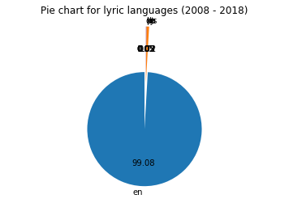
```
<center>
<font size="4"> [Graph 2(matplotlib), Source Code](https://github.com/hx67/ANLY503Project/blob/master/Part1/code/Graph3.py)</font>
</center>

```{r, fig.align='center',echo=FALSE, out.width = '80%'}
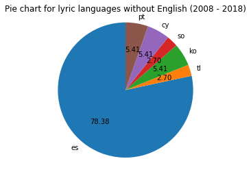
```
<center>
<font size="4"> [Graph 3(matplotlib), Source Code](https://github.com/hx67/ANLY503Project/blob/master/Part1/code/Graph4.py)</font>
</center>

#### We Can see that there are very few songs using languages other than English. The songs with different languages are deleted so that the sentimental analysis wil be more accurate.

#### The comparision between data before and after data cleaning

```{r, fig.align='center',echo=FALSE, out.width = '80%'}
knitr::include_graphics("DataCleaning.png")
```

<center> <h4>Graph 4(Tableau)</h4> </center>

##Twitter Data

#### To collect Twitter data of singer and song for past 10 years, we used Python package called GetOldTweets which enable us to put keywords and date range to collect related tweets. 300 Tweets were collected for each singer and song combination during the week when they were appeared on Billboard top 100 song. Collected Tweets were messy and contain lots of non-alphabetic symbols. And below is the top 20 non-alphabetic symbols in the Tweets.

```{r, fig.align='center',echo=FALSE, out.width = '60%'}
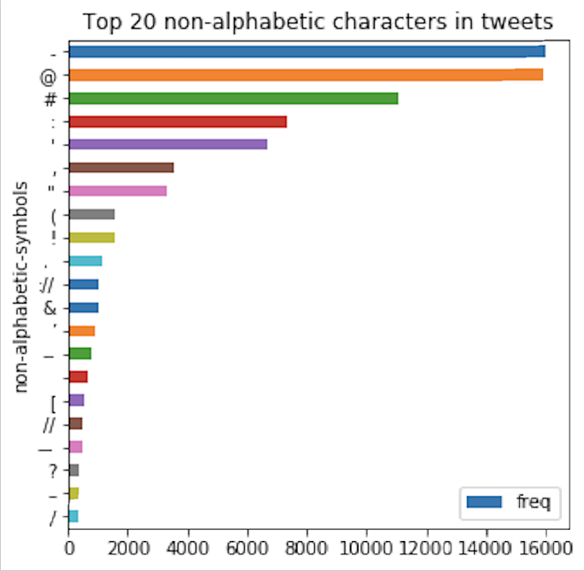
```

<center>
<font size="4"> [Graph 5(matplotlib), Source Code](/NO)</font>
</center>

#### The Hypen were most frequently used because people are more likely to refer a singer and his/her song together. @ and # are frequently used because they have their actual functionality in Twitter. We could also see that ! has a lot higher frequency than ?. From my interpretation, it is due to mood when user sending those Tweets. After listening song or hearing related news from some artists, Twitter users are less likely to raise questions, rather Twitter users are more likely to send Tweets to directly convey their emotions (like or dislike) and from sentiment analysis we could see Tweets with ! has sentiment score average at 0.6. 

### Twitter data cleaning
#### When cleaning Twitter data, we first check whether same Twitter post link appear more than once in our dataset, if it does we remove all those duplicate records. Then we removed those non-alphabetic symbol  and also hyper-link from text data. And the plot below provide statistics on those records we cleaned.

```{r, fig.align='center', echo=FALSE, out.width = '60%'}
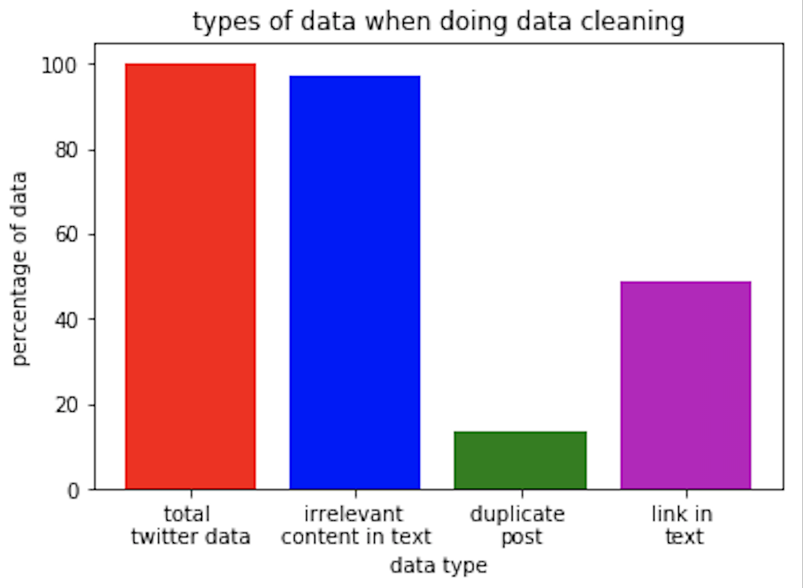
```

<center>
<font size="4"> [Graph 6(matplotlib), Source Code](/NO)</font>
</center>

### Twitter sentiment analysis

#### To generate sentiment score for each Tweets, we build our sentiment analysis tool using Word2Vec and Deep Learning tools. We first obtain our training dataset which has 1.4 million of Twitter data with labelled sentiment score from Sentiment140. Then we tokenize both training data and our own Twitter data using NLTK tokenizer. Then vectorize each token using gensim Word2Vec model with vector size 512 and window size 10. Then construct our 7 layer Convolutional Neural Network model and trained it using our training data.
#### With 10 fold cross validation, we gained 75% accuracy and we apply our model to predict sentiment score on collected Twitter data. Which yield frequency distribution as below:

```{r, fig.align='center', echo=FALSE, out.width = '60%'}
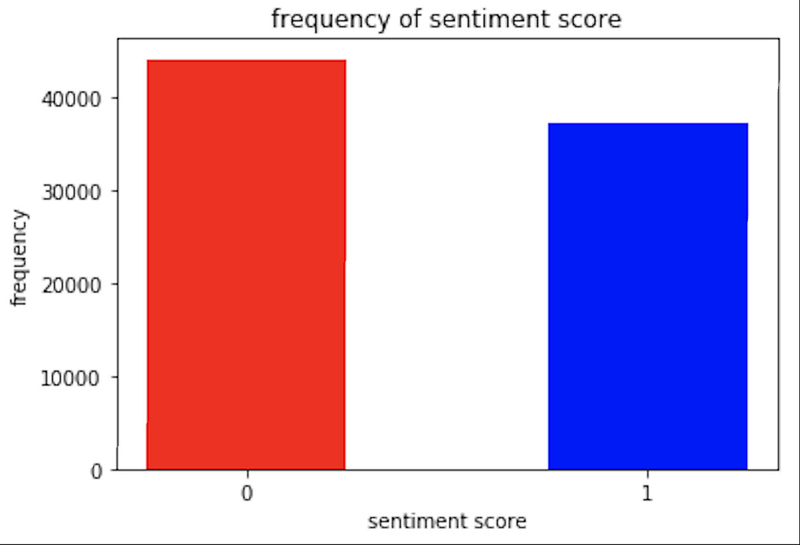
```

<center>
<font size="4"> [Graph 7(matplotlib), Source Code](/NO)</font>
</center>

# 1. What are the most frequent words used in Populor Songs?
#### Let's start to find our answer by showing some EDA plot. In the first sub-question, our team want to simply study what is the word used most frequently in the lyrics. We first use the word cloud plot for all the songs in Billboard Top 100 to study it. 

```{r, fig.align='center', echo=FALSE, out.width = '100%'}
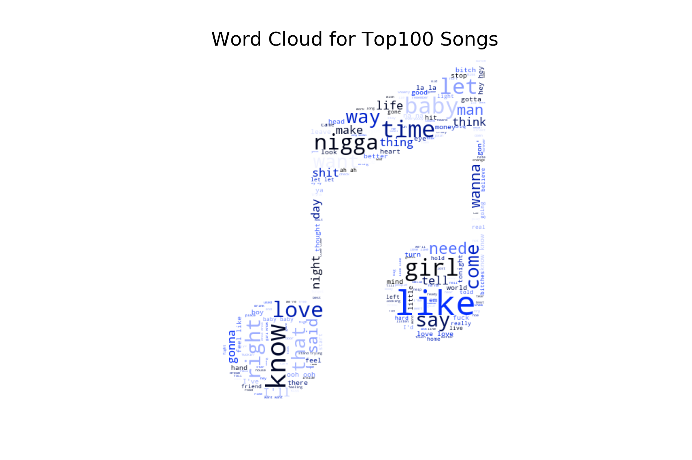
```
<center>
<font size="4"> [Graph 8(matplotlib, Word Cloud), Source Code](https://github.com/hx67/ANLY503Project/blob/master/Part1/code/Graph9.py)</font> 
</center>

#### According can see that KNOW and LIKE are the most frequent words in the songs. This suggests that there are a lot of songs related to love in the songs. However, we can also see offensive and slang Words like NIGGA and BITCH in the plot. Most of these offensive words indicates hateful thoughts and moods. We furtherly study the lyrics by plotting the world cloud for those songs which had reached to Top 5 in the Billboard.

```{r, fig.align='center', echo=FALSE, out.width = '100%'}
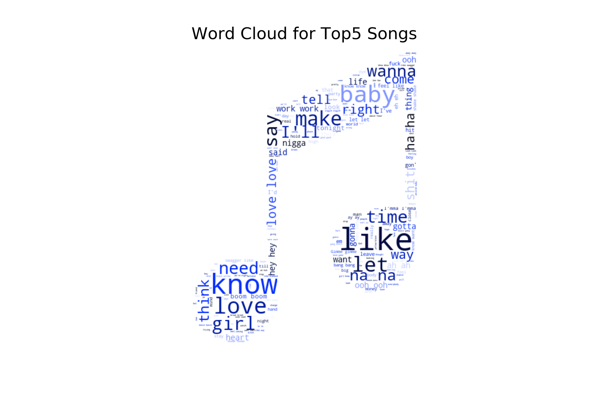
```
<center>
<font size="4"> [Graph 9(Matplotlib, Word Cloud), Source Code](https://github.com/hx67/ANLY503Project/blob/master/Part1/code/Graph9.py)</font> 
</center>

#### The plot shows that there are still a lot of words related to love and romantics. Besides, there are less dirty words in the higher ranking songs, the reason might be that these songs are accepted by more people and people are less acceptable with lyrics full of offensive words.

```{r , fig.align='center', echo=FALSE, out.width = '100%', message=FALSE,warning=FALSE}
library(plotly)
knitr::opts_chunk$set(fig.width=10, fig.height=5)
```

# 2. What Have Changed to Popular Songs?

Now, our team want to study the trend for the development of popular music throughout the years. The plots will show how the names of songs changed, what kind of songs will stay in the Billboard longer

**Source**: BillBoard Top 100 Weekly List, 1990 - 2010  
**Data Grabbed**: Song Name, Artist, Number of Weeks Stayed on Billboard, Year, Peak Position, and Lyrics
  
  
### 1. How did the Song Name Change from 1990 to 2017?  
#### - Calculated the Average Number of Words in Song Names and Visualized by Year  
#### - The Avergae Number of Words Shortened Significantly

```{r ,fig.align='center', echo=FALSE, out.width = '100%', message=FALSE, warning=FALSE}
trace1 <- list(
  x = c(1990, 1991, 1992, 1993, 1994, 1995, 1996, 1997, 1998, 1999, 2000, 2001, 2002, 
        2003, 2004, 2005, 2006, 2007, 2008, 2009, 2010, 2011, 2012, 2013, 2014, 2015, 2016, 2017), 
  y = c(3.47654320988, 3.56145251397, 3.5166163142, 3.45921450151, 3.62080536913, 3.63503649635, 3.775, 
        3.55555555556, 3.53086419753, 3.26086956522, 3.24817518248, 3.144, 3.16666666667, 3.08646616541, 
        2.89015151515, 2.97202797203, 3.12418300654, 2.87412587413, 2.98, 2.99335548173, 3.1619047619, 
        3.0608974359, 2.972, 2.80608365019, 2.77559055118, 2.66064981949, 2.65925925926, 2.4701986755), 
  line = list(
    color = "rgb(22, 96, 167)", 
    width = 4
  ), 
  mode = "lines+markers", 
  name = "Average Length of Song Names", 
  type = "scatter", 
  xsrc = "lufeiwang:40:a32ddd", 
  ysrc = "lufeiwang:40:ac88e4"
)
data <- list(trace1)
layout <- list(
  title = "Average Length of Song Names, 1990 to 2017", 
  xaxis = list(title = "Year"), 
  yaxis = list(title = "Length")
)
p <- plot_ly()
p <- add_trace(p, x=trace1$x, y=trace1$y, line=trace1$line, mode=trace1$mode, name=trace1$name, type=trace1$type, xsrc=trace1$xsrc, ysrc=trace1$ysrc)
p <- layout(p, title=layout$title, xaxis=layout$xaxis, yaxis=layout$yaxis)
p
```
<center>
<font size="4">[Graph 10(Plotly), Source Code](https://github.com/hx67/ANLY503Project/blob/master/Part1/code/Graph10.R)</font> 
</center>

## 2. Is There Any Difference Between the Top 50 Songs and the Bottom 50 Songs?  
#### - This time we calculated average num of words in song names again, but split by Top 50 and Bottom 50   
#### - The Bottom 50, the relatively less popular songs, have more variations  
#### - The Top 50, the most popular songs, have more steady decrease

```{r ,fig.align='center', echo=FALSE, out.width = '100%', message=FALSE, warning=FALSE}
trace1 <- list(
  x = c(1990, 1991, 1992, 1993, 1994, 1995, 1996, 1997, 1998, 1999, 2000, 2001, 2002, 2003, 
        2004, 2005, 2006, 2007, 2008, 2009, 2010, 2011, 2012, 2013, 2014, 2015, 2016, 2017), 
  y = c(3.47654320988, 3.56145251397, 3.5166163142, 3.45921450151, 3.62080536913, 3.63503649635, 
        3.775, 3.55555555556, 3.53086419753, 3.26086956522, 3.24817518248, 3.144, 3.16666666667, 
        3.08646616541, 2.89015151515, 2.97202797203, 3.12418300654, 2.87412587413, 2.98, 2.99335548173, 
        3.1619047619, 3.0608974359, 2.972, 2.80608365019, 2.77559055118, 2.66064981949, 2.65925925926, 2.4701986755), 
  line = list(
    color = "rgb(22, 96, 167)", 
    width = 4
  ), 
  mode = "lines+markers", 
  name = "Top 50 Songs", 
  type = "scatter", 
  xsrc = "lufeiwang:46:4b5bdd", 
  ysrc = "lufeiwang:46:53d10b"
)
trace2 <- list(
  x = c(1990, 1991, 1992, 1993, 1994, 1995, 1996, 1997, 1998, 1999, 2000, 2001, 2002, 2003, 2004, 2005, 2006, 
        2007, 2008, 2009, 2010, 2011, 2012, 2013, 2014, 2015, 2016, 2017), 
  y = c(3.63235294118, 3.94117647059, 4.26666666667, 3.16666666667, 4.3, 4.125, 4.65384615385, 4.18571428571, 
        3.0987654321, 3.57142857143, 2.93333333333, 2.55555555556, 2.88888888889, 3.125, 2.75, 3.6, 3.74074074074, 
        3.75, 2.9375, 2.85714285714, 3.3164556962, 3.125, 2.9512195122, 2.62068965517, 2.89130434783, 2.79069767442,
        2.375, 2.28571428571), 
  line = list(
    color = "rgb(205, 12, 24)", 
    dash = "dash", 
    width = 4
  ), 
  mode = "lines+markers", 
  name = "Bottom 50 Songs", 
  type = "scatter", 
  xsrc = "lufeiwang:46:4b5bdd", 
  ysrc = "lufeiwang:46:5c9e0c"
)
data <- list(trace1, trace2)
layout <- list(
  title = "Average Length of Song Names, 1990 to 2017", 
  xaxis = list(title = "Years"), 
  yaxis = list(title = "Length")
)
p <- plot_ly()
p <- add_trace(p, x=trace1$x, y=trace1$y, line=trace1$line, mode=trace1$mode, name=trace1$name, type=trace1$type, xsrc=trace1$xsrc, ysrc=trace1$ysrc)
p <- add_trace(p, x=trace2$x, y=trace2$y, line=trace2$line, mode=trace2$mode, name=trace2$name, type=trace2$type, xsrc=trace2$xsrc, ysrc=trace2$ysrc)
p <- layout(p, title=layout$title, xaxis=layout$xaxis, yaxis=layout$yaxis)
p
```
<center>
<font size="4">[Graph 11(Plotly), Source Code](https://github.com/hx67/ANLY503Project/blob/master/Part1/code/Graph12.R)</font> 
</center>

### 3. What Songs Are More Likely to Stay Popular for Longer?  

#### - Measured by Number of Weeks Stayed on Billboard  
#### - By Year and Number of Words in Song Names

```{r ,fig.align='center', echo=FALSE, out.width = '100%', message=FALSE, warning=FALSE}
layout <- list(
  title = "Heat Map of Number of Weeks Stayed on BillBoard", 
  xaxis = list(title = "Years")
)
p <- plot_ly(x = c(1990, 1991, 1992, 1993, 1994, 1995, 1996, 1997, 1998, 1999, 2000, 2001, 
        2002, 2003, 2004, 2005, 2006, 2007, 2008, 2009, 2010, 2011, 2012, 2013, 2014, 2015, 2016, 2017), 
  y = c("1 word", "2 words", "3 words", "4 words", "> 5 words"), 
  z = matrix(c(26.86, 28.5277777778, 21.0909090909, 34.88, 24.5161290323, 29.0638297872, 22.2702702703, 
               26.6666666667, 22.2564102564, 22.0, 23.8857142857, 22.5609756098, 22.0, 20.1463414634, 23.2, 18.64, 
               21.511627907, 17.606557377, 21.724137931, 14.9180327869, 17.2096774194, 12.0634920635, 15.9534883721, 
               16.5909090909, 17.4029850746, 11.0694444444, 13.0625, 10.2857142857, 20.1764705882, 15.6615384615, 18.9827586207, 
               18.5423728814, 19.3134328358, 16.5689655172, 18.4745762712, 20.2978723404, 20.1228070175, 16.0517241379, 
               15.323943662, 18.1578947368, 17.4237288136, 19.7878787879, 19.734375, 17.5421686747, 15.7848101266, 14.8275862069,                15.0, 14.4301075269, 10.8901098901, 13.3764705882, 17.1728395062, 14.2828282828, 14.3625, 13.7173913043, 
               12.1315789474, 6.57723577236, 16.4047619048, 16.7378640777, 17.8426966292, 16.1489361702, 18.1527777778, 
               18.3783783784, 14.5192307692, 18.04, 17.0, 15.7142857143, 17.7671232877, 18.9577464789, 18.2025316456, 
               16.0657894737, 17.4625, 18.0384615385, 15.7586206897, 16.625, 16.3404255319, 13.9130434783, 14.2526315789, 
               13.4485981308, 14.141025641, 15.5128205128, 14.0, 11.9285714286, 10.9583333333, 9.41379310345, 13.1568627451, 
               14.8767123288, 15.3442622951, 16.5849056604, 16.4230769231, 15.7727272727, 18.4358974359, 18.6507936508, 
               15.0428571429, 19.3018867925, 19.3157894737, 21.28, 17.7234042553, 16.8222222222, 17.5769230769, 16.9, 
               13.4307692308, 16.5818181818, 13.5531914894, 13.75, 13.1538461538, 11.7183098592, 13.25, 10.275, 14.170212766, 
               14.6545454545, 14.5614035088, 8.4375, 12.5909090909, 14.9897959184, 15.9787234043, 14.2592592593, 15.7325581395, 
               17.0505050505, 18.1714285714, 17.1325301205, 12.8382352941, 17.0350877193, 15.8113207547, 17.4, 16.9183673469, 
               16.4782608696, 14.3548387097, 13.5, 12.4745762712, 11.8085106383, 11.5689655172, 10.1960784314, 10.2352941176, 
               10.775862069, 13.512195122, 12.5526315789, 12.2564102564, 15.8387096774, 16.4814814815, 12.652173913), 
                nrow=5, ncol=28, byrow = T), type = "heatmap", colors = colorRamp(c("white", "firebrick3")))

p <- layout(p, title=layout$title, xaxis=layout$xaxis)
p
```
<center>
<font size="4">[Graph 12(Plotly), Source Code](https://github.com/hx67/ANLY503Project/blob/master/Part1/code/Graph12.R)</font> 
</center>

### 4. What Lyrics Made Songs Popular from 2008 - 2018?

#### - Ranked artists by number of songs from them that were ever on BillBoard  
#### - Ranked the Top 20 most common words used by those popular singers

<center>
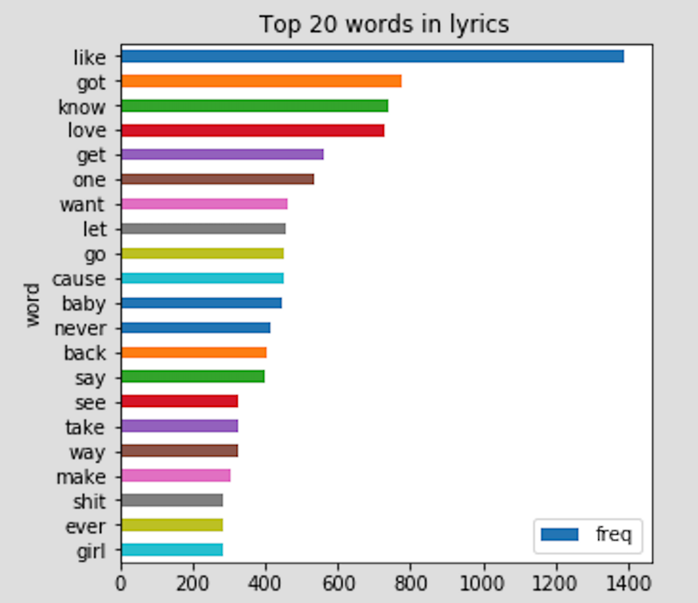
</center>
<center>
<font size="4">[Graph 13(Matplotlib), Source Code](https://github.com/hx67/ANLY503Project/blob/master/Part1/code/NO)</font> 
</center>
  
# 3. Who is the most popular singers in last ten years in Billboard?

#### First let us have a look at those artists with the most songs on Billboard's Top 100 Hits in the last ten years.

```{r,fig.align='center', echo=FALSE, out.width = '100%', message=FALSE, warning=FALSE}
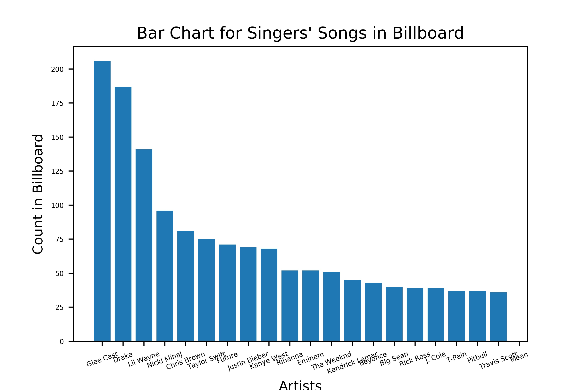
```

<center>
<font size="4"> [Graph 15(Matplotlib), Source Code](https://github.com/hx67/ANLY503Project/blob/master/Part1/code/Graph15.py)</font> 
</center>

#### Does those singers with more songs count have higher rank in the board?
<center>
<iframe src="https://public.tableau.com/profile/.3864#!/vizhome/ANLY503Project1_3/Sheet2?publish=yes" width="900" height="500"></iframe>
</center>

<center> <h4>Graph 16(Tableau)</h4> </center>

#### According to the plot above, the answer is no. Not let us consider what is the relationship between the number of singers' songs with the number of weeks on the Billboard Top100.

```{r,fig.align='center', echo=FALSE, out.width = '100%', message=FALSE, warning=FALSE}
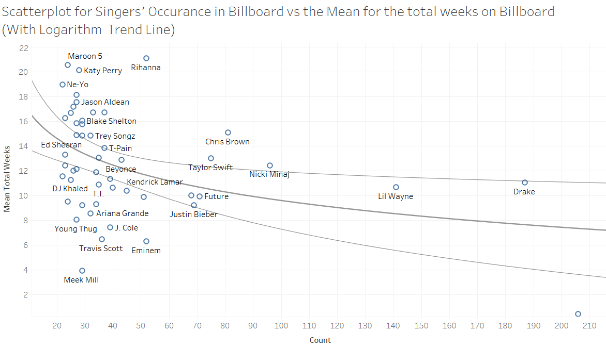
```

<center> <h4>Graph 17(Tableau)</h4> </center>

#### It seems there is a logarithm relationship between the count and the mean total weeks of songs on the Billboard.

# 4.What is the characters for those popular songs' lyrics?
# Talyor Swift Example

```{r ,fig.align='center', echo=FALSE, out.width = '100%', warning=FALSE}
library(magrittr)
library(stringr)
library(dplyr)
library(ggplot2)
library(tm)
library(wordcloud)
library(syuzhet)
library(tidytext)
library(tidyr)
library(igraph)
library(ggraph)
library(readr)
library(circlize)
library(reshape2)

lyrics <- read.csv('./data/taylor_swift_lyrics.csv')

lyrics$length <- str_count(lyrics$lyric,"\\S+") 

length_df <- lyrics %>% 
             group_by(track_title) %>% 
             summarise(length = sum(length))

length_df %>% 
  arrange(length) %>%
  slice(1:10)

ggplot(length_df, aes(x=length)) + 
  geom_histogram(bins=30,aes(fill = ..count..)) + 
  geom_vline(aes(xintercept=mean(length)),
             color="#FFFFFF", linetype="dashed", size=1) +
  geom_density(aes(y=25 * ..count..),alpha=.2, fill="#1CCCC6") +
  ylab("Count") + xlab ("Length") + 
  ggtitle("Distribution of word count") + 
  theme_minimal()
```

<center>
<font size="4"> [Graph 18(ggplot), Source Code](https://github.com/hx67/ANLY503Project/blob/master/Part1/code/Graph18.R)</font> 
</center>

#### The average word count for the tracks stands close to 375, and chart shows that maximum number of songs fall in between 345 to 400 words. The density plot shows that the distribution is close to a normal distribution.

```{r ,fig.align='center', echo=FALSE, out.width = '100%', message=FALSE, warning=FALSE}
lyrics %>% 
group_by(track_title,year, album) %>% 
summarise(length = sum(length)) -> length_df_track

ggplot(length_df_track, aes(x=reorder(album, year), y=length, fill=album))+
  geom_boxplot()+xlab("Count")+ylab("Album")+
  ggtitle("Boxplot for Album-wise Word Count")
```

<center>
<font size="4"> [Graph 19(ggplot), Source Code](https://github.com/hx67/ANLY503Project/blob/master/Part1/code/Graph19.R)</font> 
</center>

#### The Album-wise word count shows that there tend to be more words in the lastest album.

```{r,fig.align='center', echo=FALSE, out.width = '100%', message=FALSE, warning=FALSE}
#adding year column by matching track_title
length_df$year <- lyrics$year[match(length_df$track_title, lyrics$track_title)] 

length_df %>% 
 group_by(year) %>% 
 summarise(length = mean(length)) %>%
   ggplot(., aes(x= factor(year), y=length, group = 1)) +
   geom_line(colour="#1CCCC6", size=1) + 
   ylab("Average word count") + xlab ("Year") + 
   ggtitle("Year-wise average Word count change") + 
   theme_minimal()   
```

<center>
<font size="4"> [Graph 20(ggplot), Source Code](https://github.com/hx67/ANLY503Project/blob/master/Part1/code/Graph20.R)</font> 
</center>

#### This plot shows the similiar result. This means, to be a super star, your need to convey more information in your songs, with which you can influence your audience.

```{r,fig.align='center', echo=FALSE, out.width = '100%', message=FALSE, warning=FALSE}
lyrics_text <- lyrics$lyric
#Removing punctations and alphanumeric content
lyrics_text<- gsub('[[:punct:]]+', '', lyrics_text)
lyrics_text<- gsub("([[:alpha:]])\1+", "", lyrics_text)

# Getting the sentiment value for the lyrics
ty_sentiment <- get_nrc_sentiment((lyrics_text))

# Dataframe with cumulative value of the sentiments
sentimentscores<-data.frame(colSums(ty_sentiment[,]))

# Dataframe with sentiment and score as columns
names(sentimentscores) <- "Score"
sentimentscores <- cbind("sentiment"=rownames(sentimentscores),sentimentscores)
rownames(sentimentscores) <- NULL

# Plot for the cumulative sentiments
ggplot(data=sentimentscores,aes(x=sentiment,y=Score))+
geom_bar(aes(fill=sentiment),stat = "identity")+
theme(legend.position="none")+
xlab("Sentiments")+ylab("Scores")+
ggtitle("Total sentiment based on scores")+
theme_minimal() 
```

<center>
<font size="4"> [Graph 21(ggplot), Source Code](https://github.com/hx67/ANLY503Project/blob/master/Part1/code/Graph21.R)</font> 
</center>

#### Basically, the most frequent mood in the songs is positve. And we can see that Talyor Swift have expressed all kinds emotions in her songs. Joy, anticipation and trust emerge as the top 3.

```{r,fig.align='center', echo=FALSE, out.width = '100%', message=FALSE, warning=FALSE}
lyrics$lyric <- as.character(lyrics$lyric)

tidy_lyrics <- lyrics %>% 
unnest_tokens(word,lyric)

song_wrd_count <- tidy_lyrics %>% count(track_title)

lyric_counts <- tidy_lyrics %>%
left_join(song_wrd_count, by = "track_title") %>% 
rename(total_words=n)

lyric_sentiment <- tidy_lyrics %>% 
inner_join(get_sentiments("nrc"),by="word")

lyric_sentiment %>% 
count(word,sentiment,sort=TRUE) %>% 
group_by(sentiment)%>%top_n(n=10) %>% 
ungroup() %>%
ggplot(aes(x=reorder(word,n),y=n,fill=sentiment)) +
geom_col(show.legend = FALSE) + 
facet_wrap(~sentiment,scales="free") +
xlab("Sentiments") + ylab("Scores")+
ggtitle("Top words used to express emotions and sentiments") +
coord_flip()
```

<center>
<font size="4"> [Graph 22(ggplot), Source Code](https://github.com/hx67/ANLY503Project/blob/master/Part1/code/Graph22.R)</font> 
</center>

#### Now that we have figured out the overall sentiment scores, we should find out the top words that contribute to various emotions and positive/negative sentiment.The visualization given shows that while the word bad is predominant in emotions such as anger, disgust, sadness and fear, Surprise and trust are driven by the word good.

```{r,fig.align='center', echo=FALSE, out.width = '100%', message=FALSE, warning=FALSE}
grid.col = c("2006" = "#E69F00", "2008" = "#56B4E9", "2010" = "#009E73", "2012" = "#CC79A7", "2014" = "#D55E00", "2017" = "#00D6C9", "anger" = "grey", "anticipation" = "grey", "disgust" = "grey", "fear" = "grey", "joy" = "grey", "sadness" = "grey", "surprise" = "grey", "trust" = "grey")

year_emotion <- lyric_sentiment %>%
filter(!sentiment %in% c("positive", "negative")) %>%
count(sentiment, year) %>%
group_by(year, sentiment) %>%
summarise(sentiment_sum = sum(n)) %>%
ungroup()

circos.clear()

#Setting the gap size
circos.par(gap.after = c(rep(6, length(unique(year_emotion[[1]])) - 1), 15,
rep(6, length(unique(year_emotion[[2]])) - 1), 15))

chordDiagram(year_emotion, grid.col = grid.col, transparency = .2)
title("Relationship between emotion and song's year of release")

```

<center>
<font size="4"> [Graph 23(ggplot), Source Code](https://github.com/hx67/ANLY503Project/blob/master/Part1/code/Graph23.R)</font> 
</center>

#### We can see that joy has maximum share for the years 2010 and 2014. Overall, surprise, disgust and anger  are the emotions with least score; however, in comparison to other years 2017 has maximum contribution for disgust. Coming to anticipation, 2010 and 2012 have higher contribution in comparison to other years.

### Some other visualizations graphed by seaborn to see the popularity of the songs and how it changed during the years or even months.

<center>
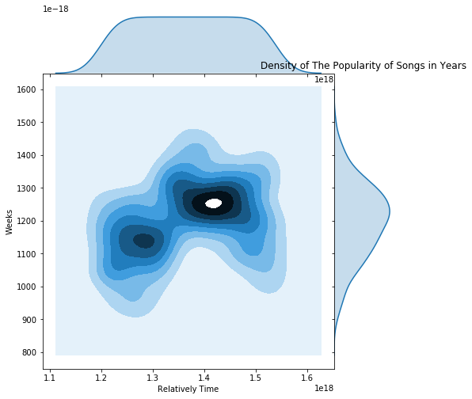
</center>
<center>
<font size="4"> [Graph 24(Seaborn), Source Code](https://github.com/hx67/ANLY503Project/blob/master/Part1/code/Graph24.py)</font> 
</center>

#### The graph above shows the density of relatively time x-aixs and the lengths of weeks that songs stayed on board. It's eaily to tell that the graph has two part of high density, which means in the middle time of these years. Around year 2014, there are lot great songs been created. Also, around year 2012, a lot songs been created but did not stay on the board as long as the songs been created in 2014.

<center>

</center>
<center>
<font size="4"> [Graph 25(Seaborn), Source Code](https://github.com/hx67/ANLY503Project/blob/master/Part1/code/Graph25.py)</font> 
</center>

#### The graph above shows the number of favorites and retweets to the songs in ten years. As we can directly see, there is a huge difference between before year 2017 and after year 2017. After year 2017, the number of favorties and retweets increased incredibly. That tells either the songs on the board have more influence after year 2017 or people started to be carzy of using tweets.

<center>
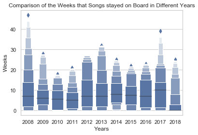
</center>

<center>
<font size="4"> [Graph 26(Seaborn), Source Code](https://github.com/hx67/ANLY503Project/blob/master/Part1/code/Graph26.py)</font> 
</center>

#### The graph above shows the distribution of songs' popularity in each year. As we can see, 2017 has highest mean, which means most songs been created in 2017 are more popular than other years. However, for 2008, although the high point is really high in this year, but the mean is low. which means it has both good songs and bad songs in this year.

<center>
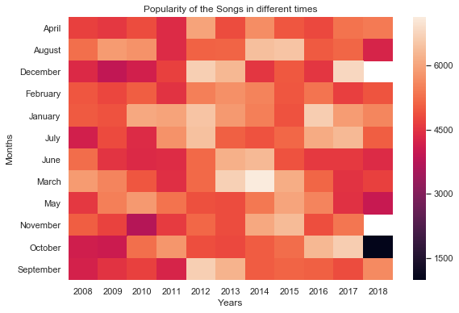

</center>
<center>
<font size="4"> [Graph 27(Seaborn), Source Code](https://github.com/hx67/ANLY503Project/blob/master/Part1/code/Graph27.py)</font> 
</center>

#### The graph above shows the popularity of the songs in each month these years. From the graph, we also expected to see some trends through the changing of the color in the graph. And as the result we can tell from the graph, it did has a slight pattern of the increasing popularity from 2008 to around 2013. However, after that, popularity of the songs in each month became unpredictable.

# 5. Is there a relationship between the mood in songs with the Twitter Users' attitudes?

## The fifth sub-question is whether there is relationship between the sentiment analysis resutls from tweets and lyrics. In other words, the question becomes "Do the lyrics' attitudes influence people's comments about them on tweets?" and "whether the result of two attitudes' connection influence the popularity of the songs?"

#### In order to answer the questions above, we have to take a look of the results of sentiment analysis from tweets and lyrics.

<center>
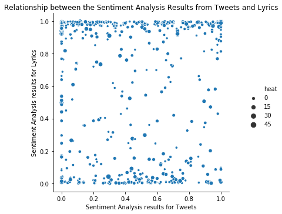

</center>
<center>
<font size="4"> [Graph 28(Seaborn), Source Code](https://github.com/hx67/ANLY503Project/blob/master/Part1/code/Graph28.py)</font> 
</center>

#### The graph above shows the two-dimensional plot of sentiment analysis attitude scores. As we can see, it seems like there is no linear relationship between the tweets' attitude and lyrics' attitude. However, we can not be sure yet untill we run some tests. Still, the graph gives us one interesting information. Most points loacte on the top and bottom of the graph, which means most of songs are either too negative or too positive. And those songs have more attetion on tweets than the normal songs.

#### Next, we took a look into each indiviual analysis result.

<center>

</center>
<center>
<font size="4"> [Graph 29(Seaborn), Source Code](https://github.com/hx67/ANLY503Project/blob/master/Part1/code/Graph29.py)</font> 
</center>

#### As the boxplot shows above, we can see that lyrics have much higher attitude points than tweets. Most of tweets' attitude points are below normal, which means they are more negative while most lyrics of the songs are tend to be positive. However, we still can not be 100% sure that they are significant different, so we will run one-way ANOVA test to testify our thoughts.

## Hypothesis test of One-Way ANOVA test.
<center>
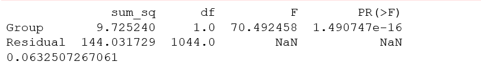
</center>
<center>
<font size="4"> [Hypothesis1, Source Code](https://github.com/hx67/ANLY503Project/blob/master/Part1/code/Hypothesis%20Test2.py)</font> 
</center>

#### As the p-value show above, since the p-value is below 0.05, which rejects the null hypothesis. Then it means there is a significant difference between lyrics' attitude points and tweets' attitude points. Since we know they are different, we are moving to the next part, to test whether there is a relationship between lyrics' attitude and tweets' attitude.

## Hypothesis test of Linear regression test.

<center>
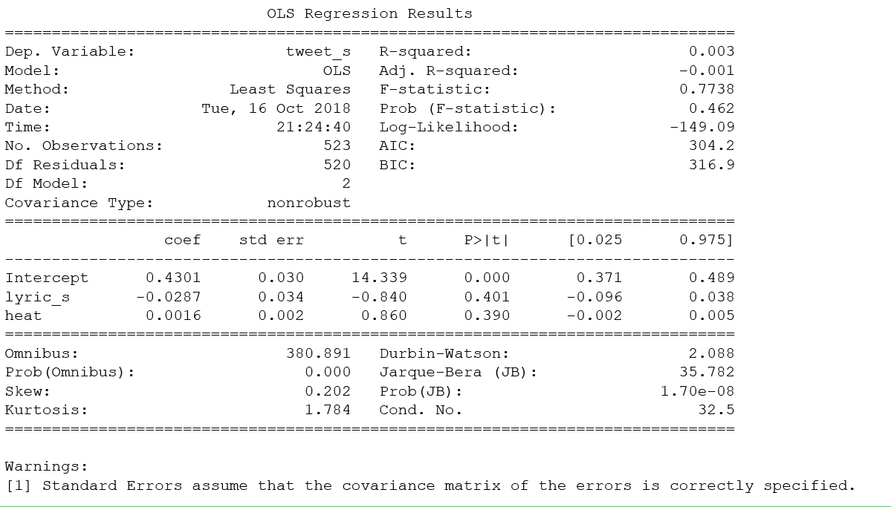
</center>

<center>
<font size="4"> [Hypothesis2, Source Code](https://github.com/hx67/ANLY503Project/blob/master/Part1/code/Hypothesis%20Test1.py)</font> 
</center>

#### As the results show above, we used the number of weeks that songs stayed on board as addition term that may relates to the attitude points. Then we found out that all p-vlaues are much greater than 0.05, which means it failed to reject he hyoithesis test, and it means there is no significant linear relationship between Tweets' attitude points and neither lyrics' attitude points nor the number of weeks that songs stayed on board( which may also be thought as popularity).

#### Through the hypothesis tests we did above, we found out that tweets' attitude and lyrics' attitude of the songs have significant differences, and there is no significant linear relationship between them. However, that does not tell the everything between them. Adding other possible related terms and use other forward tests may still get some good results. So, in the next part of project, we gonna dig much deeper to discover the possibilities that they connect with each other, and how they may influence each other in any possible ways.
