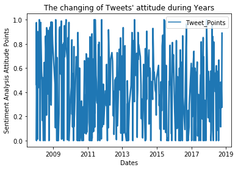
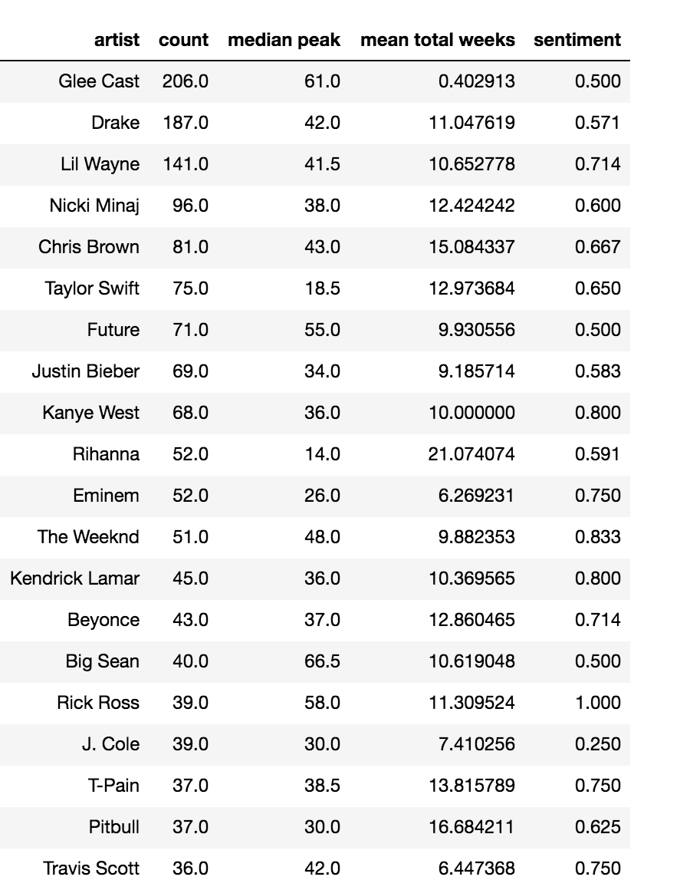
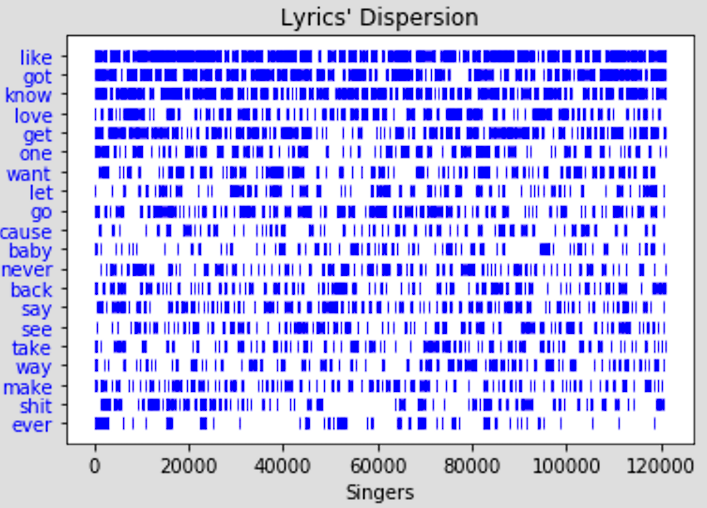

```{r setup, include=FALSE}
knitr::opts_chunk$set(echo = TRUE)
```

```{r warning=FALSE}
library(ggplot2)
```
#Overview
### Music is an important component in the entertainment. Some people say that music may tell us what the artist wants to say, but the popular music tells us what the people want to hear. This project aims to use the sentimental analysis on lyrics of popular music and Twitter posts related to the songs to reveal the secret of the successful songs/lyrics and the impact of the emotions in songs to the audience.

#Subquestions:
## 1. What is the most frequent word used in the Populor Songs?
## 2. What Have Changed to Popular Songs?
## 3. Who is the most popular singers in last ten years in Billboard?
## 4. Is there a pattern for those successful songs?
## 5. Is there a relationship between the mood in songs with the Twitter Users' attitudes?

#Data Collection and Data Cleaning

##Music Data

#### This project collected the information for music and Twitter posts from different APIs.

#### The billboard.py, a Python API for accessing music charts from Billboard.com, is used to collect the tiltles and artists' names. With the music information, the PyLyrics, a python module to get lyrics of songs from lyrics.wikia.com, helped to find those lyrics.

#### The biggest problem for the data cleaning in this part is those special signs in the titles or the singer lists:

<iframe src="https://public.tableau.com/profile/.3864#!/vizhome/ANLY503projec1-1/Sheet1?publish=yes" width="900" height="500"></iframe>

#### Besides, there are also some languages other than English in the dataset:
```{r, eval = FALSE}
import pandas as pd
df = pd.read_csv("music_lyrics.csv")
df.drop(df.columns[[0, 1]], axis=1, inplace = True)
df1 = df.dropna()
mydf = df1[df1.lyrics != 'No Lyrics']
from langdetect import detect, DetectorFactory
DetectorFactory.seed = 0
lang = []
for i in list(set(mydf.lyrics)):
    lang.append(detect(i))
from collections import Counter

Counter(lang)
import matplotlib.pyplot as plotter

pieLabels = 'en', 'es', 'tl', 'ko', 'so', 'cy', 'pt'
numofsongs = [3982, 29, 1, 2, 1, 2, 2]
figureObject, axesObject = plotter.subplots()
explodeTuple = (0.8, 0.0, 0.0, 0.0, 0.0, 0.0, 0.0)
axesObject.pie(numofsongs, explode=explodeTuple,

        labels=pieLabels,

        autopct='%1.2f',

        startangle=90)
plotter.title("Pie chart for lyric languages " + "(2008 - 2018)")
axesObject.axis('equal')


pieLabels = 'es', 'tl', 'ko', 'so', 'cy', 'pt'
numofsongs = [29, 1, 2, 1, 2, 2]
figureObject, axesObject = plotter.subplots()
axesObject.pie(numofsongs,

        labels=pieLabels,

        autopct='%1.2f',

        startangle=90)

axesObject.axis('equal')
plotter.title("Pie chart for lyric languages without English " + "(2008 - 2018)")
plotter.show()
```

```{r, echo=FALSE, out.width = '100%'}
knitr::include_graphics("Pie1.png")
knitr::include_graphics("Pie2.png")
```

#### The comparision between data before and after data cleaning

```{r, echo=FALSE, out.width = '80%'}
knitr::include_graphics("DataCleaning.png")
```


##Twitter Data

#### To collect Twitter data of singer and song for past 10 years, we used Python package called GetOldTweets which enable us to put keywords and date range to collect related tweets. 300 Tweets were collected for each singer and song combination during the week when they were appeared on Billboard top 100 song. Collected Tweets were messy and contain lots of non-alphabetic symbols. And below is the top 20 non-alphabetic symbols in the Tweets.

```{r, echo=FALSE, out.width = '100%'}
knitr::include_graphics("non_alphabetic_char_dist.png")
```

#### The Hypen were most frequently used because people are more likely to refer a singer and his/her song together. @ and # are frequently used because they have their actual functionality in Twitter. We could also see that ! has a lot higher frequency than ?. From my interpretation, it is due to mood when user sending those Tweets. After listening song or hearing related news from some artists, Twitter users are less likely to raise questions, rather Twitter users are more likely to send Tweets to directly convey their emotions (like or dislike) and from sentiment analysis we could see Tweets with ! has sentiment score average at 0.6. 

### Twitter data cleaning
#### When cleaning Twitter data, we first check whether same Twitter post link appear more than once in our dataset, if it does we remove all those duplicate records. Then we removed those non-alphabetic symbol  and also hyper-link from text data. And the plot below provide statistics on those records we cleaned.

```{r, echo=FALSE, out.width = '100%'}
knitr::include_graphics("dirty_data_dist.png")

```

### Twitter sentiment analysis

#### To generate sentiment score for each Tweets, we build our sentiment analysis tool using Word2Vec and Deep Learning tools. We first obtain our training dataset which has 1.4 million of Twitter data with labelled sentiment score from Sentiment140. Then we tokenize both training data and our own Twitter data using NLTK tokenizer. Then vectorize each token using gensim Word2Vec model with vector size 512 and window size 10. Then construct our 7 layer Convolutional Neural Network model and trained it using our training data.
#### With 10 fold cross validation, we gained 75% accuracy and we apply our model to predict sentiment score on collected Twitter data. Which yield frequency distribution as below:

```{r, echo=FALSE, out.width = '100%'}
knitr::include_graphics("twitter_sentiment_score_freq.png")

```

```{r, echo=FALSE, out.width = '100%'}

```

# 1. What are the most frequent words used in Populor Songs?

```{r eval=FALSE}
##Python Code
from os import path
from PIL import Image
import pandas as pd
import numpy as np
from wordcloud import WordCloud, STOPWORDS, ImageColorGenerator
import nltk
from nltk.corpus import stopwords
import matplotlib.pyplot as plt

def define_stopwords():
  set(stopwords.words('english'))
  
  st1 = ["ain't","I'm","after","afterwards","again","against","all","almost",
         "alone","along","already","also","although","always","am","among",
         "amongst","amoungst","amount","an","and","another","any","anyhow",
         "anyone","anything","anyway","anywhere","are","around","as","at","back",
         "be","became","because","become","becomes","becoming","been","before",
         "beforehand","behind","being","below","beside","besides","between",
         "beyond","bill","both","bottom","but","by","call","can\'t","can",
         "cannot","cant","co","con","cause","could","couldnt","cry","de",
         "describe","detail","do","done","down","due","during","each","eg",
         "eight","either","eleven","else","elsewhere","empty","enough","etc",
         "even","ever","every","everyone","everything","everywhere","except",
         "few","fifteen","fifty","fill","find","fire","first","five","for",
         "former","formerly","forty","found","four","from","front","full",
         "further","get","got","give","go","had","has","hasnt","have","he",
         "hence","her","here","hereafter","hereby","herein","hereupon","hers",
         "herself","him","himself","his","how","however","hundred","i","ie","if",
         "in","inc","indeed","interest","into","is","it","its","itself","keep",
         "last","latter","latterly","least","less","ltd","made","many","may",
         "me","meanwhile","might","mill","mine","more","moreover","most",
         "mostly","move","much","must","my","myself","name","namely","neither",
         "never","nevertheless","next","nine","no","nobody","none","noone","nor",
         "not","nothing","now","nowhere","of","off","often","oh","on","once",
         "one","only","onto","or","other","others","otherwise","our","ours",
         "ourselves","out","over","own","part","per","perhaps","please","put",
         "rather","re","same","see","seem","seemed","seeming","seems","serious",
         "several","she","should","show","side","since","sincere","six","sixty",
         "so","some","somehow","someone","something","sometime","sometimes",
         "somewhere","still","such","system","take","ten","than","that","the",
         "their","them","themselves","then","thence","there","thereafter",
         "thereby","therefore","therein","thereupon","these","they","thick",
         "thin","third","this","those","though","three","through","throughout",
         "thru","thus","to","together","too","top","toward","towards","twelve",
         "twenty","two","un","under","until","up","upon","us","very","via","was",
         "we","well","were","what","whatever","when","whence","whenever","where",
         "whereafter","whereas","whereby","wherein","whereupon","wherever",
         "whether","which","while","whither","who","whoever","whole","whom",
         "whose","why","will","with","within","without","would","yet","you",
         "yeah","your","yours","yourself","yourselves"]

  
  stop_words = stopwords.words('english')
  stop_words.extend(
      ['from', 'subject', 're', 'edu', 'use','a','about', 'above', 'across']
      +st1)
  return stop_words

def collect_text(top = None):
  lyrics_df = pd.read_csv("./music_lyrics.csv", index_col = 0)

  lyrics_df.lyrics = [
      'No Lyrics' if type(x) == float else x for x in lyrics_df.lyrics]
  
  if top != None:
    lyrics_df = lyrics_df[lyrics_df['peak'] <= top]

  text = " ".join(lyric for lyric in list(set(lyrics_df.lyrics)))
  print(
      "There are {} words in the combination of all review.".format(len(text)))
  
  return text

def transform_format(val):
    if val == 0:
        return 255
    else:
        return val

def creat_mask(image_path):
  music_coloring = np.array(Image.open(image_path))
        
  transformed_music_coloring = np.ndarray((
      music_coloring.shape[0],music_coloring.shape[1]), np.int32)
  
  for i in range(len(music_coloring)):
      transformed_music_coloring[i] = list(
          map(transform_format, music_coloring[i]))
    
  return transformed_music_coloring

def grey_color_func(
    word, font_size, position,orientation,random_state=42, **kwargs):
    return("hsl(230,100%%, %d%%)" % np.random.randint(0, 100))

# Generate a word cloud image
def generate_wordcloud(text, stop_words, coloring, output_path):
  wordcloud = WordCloud(
      stopwords=stop_words, mask=transformed_music_coloring, 
      background_color="white").generate(text)
  
  wordcloud.recolor(color_func = grey_color_func)
  
  my_dpi = 300
  plt.imshow(wordcloud, interpolation='bilinear')
  plt.axis("off")
  plt.savefig(output_path, format="png", dpi=my_dpi)

stop_words = define_stopwords()
text = collect_text(5)
transformed_music_coloring = creat_mask("./86932.png")
generate_wordcloud(
    text, stop_words, transformed_music_coloring, "music_wordcloud_top5.png")
```
```{r, echo=FALSE, out.width = '100%'}
knitr::include_graphics("music_wordcloud.png")
knitr::include_graphics("music_wordcloud_top5.png")
```

#### We can see that KNOW and LIKE are the most frequent words in the songs. 

#### Besides, there are less dirty words in the higher ranking songs.

```{r echo=FALSE, include=FALSE}
library(plotly)
knitr::opts_chunk$set(fig.width=10, fig.height=5)
```

# 2. What Have Changed to Popular Songs?

**Source**: BillBoard Top 100 Weekly List, 1990 - 2010  
**Data Grabbed**: Song Name, Artist, Number of Weeks Stayed on Billboard, Year, Peak Position, and Lyrics
  
  
### 1. How did the Song Name Change from 1990 to 2017?  
- Calculated the Average Length of All Song Names and Visualized by Year  
- The Avergae Length of Song Name Shortened Significantly  

```{r message=FALSE, warning=FALSE}
trace1 <- list(
  x = c(1990, 1991, 1992, 1993, 1994, 1995, 1996, 1997, 1998, 1999, 2000, 2001, 2002, 
        2003, 2004, 2005, 2006, 2007, 2008, 2009, 2010, 2011, 2012, 2013, 2014, 2015, 2016, 2017), 
  y = c(3.47654320988, 3.56145251397, 3.5166163142, 3.45921450151, 3.62080536913, 3.63503649635, 3.775, 
        3.55555555556, 3.53086419753, 3.26086956522, 3.24817518248, 3.144, 3.16666666667, 3.08646616541, 
        2.89015151515, 2.97202797203, 3.12418300654, 2.87412587413, 2.98, 2.99335548173, 3.1619047619, 
        3.0608974359, 2.972, 2.80608365019, 2.77559055118, 2.66064981949, 2.65925925926, 2.4701986755), 
  line = list(
    color = "rgb(22, 96, 167)", 
    width = 4
  ), 
  mode = "lines+markers", 
  name = "Average Length of Song Names", 
  type = "scatter", 
  xsrc = "lufeiwang:40:a32ddd", 
  ysrc = "lufeiwang:40:ac88e4"
)
data <- list(trace1)
layout <- list(
  title = "Average Length of Song Names, 1990 to 2017", 
  xaxis = list(title = "Year"), 
  yaxis = list(title = "Length")
)
p <- plot_ly()
p <- add_trace(p, x=trace1$x, y=trace1$y, line=trace1$line, mode=trace1$mode, name=trace1$name, type=trace1$type, xsrc=trace1$xsrc, ysrc=trace1$ysrc)
p <- layout(p, title=layout$title, xaxis=layout$xaxis, yaxis=layout$yaxis)
p
```
  
## 2. Is There Any Difference Between Top 50 Songs and Bottom 50 Songs?  
#### - This Time I calculated Average Length Again, but split by Top 50 and Bottom 50   
#### - Bottom 50 have more variations  
#### - Top 50, the more popular songs, have more steady decrease

```{r }

trace1 <- list(
  x = c(1990, 1991, 1992, 1993, 1994, 1995, 1996, 1997, 1998, 1999, 2000, 2001, 2002, 2003, 
        2004, 2005, 2006, 2007, 2008, 2009, 2010, 2011, 2012, 2013, 2014, 2015, 2016, 2017), 
  y = c(3.47654320988, 3.56145251397, 3.5166163142, 3.45921450151, 3.62080536913, 3.63503649635, 
        3.775, 3.55555555556, 3.53086419753, 3.26086956522, 3.24817518248, 3.144, 3.16666666667, 
        3.08646616541, 2.89015151515, 2.97202797203, 3.12418300654, 2.87412587413, 2.98, 2.99335548173, 
        3.1619047619, 3.0608974359, 2.972, 2.80608365019, 2.77559055118, 2.66064981949, 2.65925925926, 2.4701986755), 
  line = list(
    color = "rgb(22, 96, 167)", 
    width = 4
  ), 
  mode = "lines+markers", 
  name = "Top 50 Songs", 
  type = "scatter", 
  xsrc = "lufeiwang:46:4b5bdd", 
  ysrc = "lufeiwang:46:53d10b"
)
trace2 <- list(
  x = c(1990, 1991, 1992, 1993, 1994, 1995, 1996, 1997, 1998, 1999, 2000, 2001, 2002, 2003, 2004, 2005, 2006, 
        2007, 2008, 2009, 2010, 2011, 2012, 2013, 2014, 2015, 2016, 2017), 
  y = c(3.63235294118, 3.94117647059, 4.26666666667, 3.16666666667, 4.3, 4.125, 4.65384615385, 4.18571428571, 
        3.0987654321, 3.57142857143, 2.93333333333, 2.55555555556, 2.88888888889, 3.125, 2.75, 3.6, 3.74074074074, 
        3.75, 2.9375, 2.85714285714, 3.3164556962, 3.125, 2.9512195122, 2.62068965517, 2.89130434783, 2.79069767442,
        2.375, 2.28571428571), 
  line = list(
    color = "rgb(205, 12, 24)", 
    dash = "dash", 
    width = 4
  ), 
  mode = "lines+markers", 
  name = "Bottom 50 Songs", 
  type = "scatter", 
  xsrc = "lufeiwang:46:4b5bdd", 
  ysrc = "lufeiwang:46:5c9e0c"
)
data <- list(trace1, trace2)
layout <- list(
  title = "Average Length of Song Names, 1990 to 2017", 
  xaxis = list(title = "Years"), 
  yaxis = list(title = "Length")
)
p <- plot_ly()
p <- add_trace(p, x=trace1$x, y=trace1$y, line=trace1$line, mode=trace1$mode, name=trace1$name, type=trace1$type, xsrc=trace1$xsrc, ysrc=trace1$ysrc)
p <- add_trace(p, x=trace2$x, y=trace2$y, line=trace2$line, mode=trace2$mode, name=trace2$name, type=trace2$type, xsrc=trace2$xsrc, ysrc=trace2$ysrc)
p <- layout(p, title=layout$title, xaxis=layout$xaxis, yaxis=layout$yaxis)
p
```

### 3. What Songs Are More Likely to Stay Popular for Longer?  

#### - Measured by Number of Weeks Stayed on Billboard  

#### - By Year and Length of Words  

```{r }
layout <- list(
  title = "Heat Map of Number of Weeks Stayed on BillBoard", 
  xaxis = list(title = "Years")
)
p <- plot_ly(x = c(1990, 1991, 1992, 1993, 1994, 1995, 1996, 1997, 1998, 1999, 2000, 2001, 
        2002, 2003, 2004, 2005, 2006, 2007, 2008, 2009, 2010, 2011, 2012, 2013, 2014, 2015, 2016, 2017), 
  y = c("1 word", "2 words", "3 words", "4 words", "> 5 words"), 
  z = matrix(c(26.86, 28.5277777778, 21.0909090909, 34.88, 24.5161290323, 29.0638297872, 22.2702702703, 
               26.6666666667, 22.2564102564, 22.0, 23.8857142857, 22.5609756098, 22.0, 20.1463414634, 23.2, 18.64, 
               21.511627907, 17.606557377, 21.724137931, 14.9180327869, 17.2096774194, 12.0634920635, 15.9534883721, 
               16.5909090909, 17.4029850746, 11.0694444444, 13.0625, 10.2857142857, 20.1764705882, 15.6615384615, 18.9827586207, 
               18.5423728814, 19.3134328358, 16.5689655172, 18.4745762712, 20.2978723404, 20.1228070175, 16.0517241379, 
               15.323943662, 18.1578947368, 17.4237288136, 19.7878787879, 19.734375, 17.5421686747, 15.7848101266, 14.8275862069,                15.0, 14.4301075269, 10.8901098901, 13.3764705882, 17.1728395062, 14.2828282828, 14.3625, 13.7173913043, 
               12.1315789474, 6.57723577236, 16.4047619048, 16.7378640777, 17.8426966292, 16.1489361702, 18.1527777778, 
               18.3783783784, 14.5192307692, 18.04, 17.0, 15.7142857143, 17.7671232877, 18.9577464789, 18.2025316456, 
               16.0657894737, 17.4625, 18.0384615385, 15.7586206897, 16.625, 16.3404255319, 13.9130434783, 14.2526315789, 
               13.4485981308, 14.141025641, 15.5128205128, 14.0, 11.9285714286, 10.9583333333, 9.41379310345, 13.1568627451, 
               14.8767123288, 15.3442622951, 16.5849056604, 16.4230769231, 15.7727272727, 18.4358974359, 18.6507936508, 
               15.0428571429, 19.3018867925, 19.3157894737, 21.28, 17.7234042553, 16.8222222222, 17.5769230769, 16.9, 
               13.4307692308, 16.5818181818, 13.5531914894, 13.75, 13.1538461538, 11.7183098592, 13.25, 10.275, 14.170212766, 
               14.6545454545, 14.5614035088, 8.4375, 12.5909090909, 14.9897959184, 15.9787234043, 14.2592592593, 15.7325581395, 
               17.0505050505, 18.1714285714, 17.1325301205, 12.8382352941, 17.0350877193, 15.8113207547, 17.4, 16.9183673469, 
               16.4782608696, 14.3548387097, 13.5, 12.4745762712, 11.8085106383, 11.5689655172, 10.1960784314, 10.2352941176, 
               10.775862069, 13.512195122, 12.5526315789, 12.2564102564, 15.8387096774, 16.4814814815, 12.652173913), 
                nrow=5, ncol=28, byrow = T), type = "heatmap", colors = colorRamp(c("white", "firebrick3")))

p <- layout(p, title=layout$title, xaxis=layout$xaxis)
p
```


### 4. What Lyrics Made Songs Popular from 2008 - 2018?

#### - Ranked artists by number of songs that were ever on BillBoard  

#### - Take all the songs from the top 20 artists  

```{r eval=FALSE}
from matplotlib import pylab
import matplotlib.pyplot as plt

def plot_freq_words(fdist):
    df = pd.DataFrame(columns=('word', 'freq'))
    i = 0
    for word, frequency in fdist.most_common(21):
        df.loc[i] = (word, frequency)
        i += 1

    title = 'Top %s words in lyrics' % top_n
    df.plot.barh(x='word', y='freq', title=title, figsize=(5,5)).invert_yaxis()
    
    return
    
top_n = 20

plot_freq_words(fdist)

```



#### - Ranked the Top 20 most common words  


  
### How are these common words used by the Top 20 Artists?  
#### - 5. Visualized there Lexical Dispersion Over the Most Common words  


# 3. Who is the most popular singers in last ten years in Billboard?

#### First let us have a look at those artists with the most songs on Billboard's Top 100 Hits in the last ten years.

```{r eval=FALSE}
##Python Code
import pandas as pd
import matplotlib.pyplot as plt
import squarify
import numpy as np

df = pd.read_csv('top20.csv')
count = df['count']
y_pos = np.arange(len((df.artist)))
plt.bar(y_pos, count)
plt.tick_params(axis = 'both', which = 'major', labelsize = 5)
plt.xticks(y_pos, (df.artist), rotation=20)
plt.xlabel('Artists')
plt.ylabel('Count in Billboard')
plt.title("Bar Chart for Singers' Songs in Billboard")
#plt.figure(figsize=(1000,1000))
plt.savefig('top20count.jpg', format="jpg", dpi = 500)
```
```{r, echo=FALSE, out.width = '100%'}
knitr::include_graphics("top20count.jpg")
```

#### Does those singers with more songs count have higher rank in the board?

<iframe src="https://public.tableau.com/profile/.3864#!/vizhome/ANLY503Project1_3/Sheet2?publish=yes" width="900" height="500"></iframe>

#### According to the plot above, the answer is no. Not let us consider what is the relationship between the number of singers' songs with the number of weeks on the Billboard Top100.

```{r, echo=FALSE, fout.width = '100%'}
knitr::include_graphics("Scatterplot.png")
```

#### It seems there is a logarithm relationship between the count and the mean total weeks of songs on the Billboard.

# 4.What is the characters for those popular songs' lyrics?
# Talyor Swift Example

```{r}
library(magrittr)
library(stringr)
library(dplyr)
library(ggplot2)
library(tm)
library(wordcloud)
library(syuzhet)
library(tidytext)
library(tidyr)
library(igraph)
library(ggraph)
library(readr)
library(circlize)
library(reshape2)

lyrics <- read.csv('taylor_swift_lyrics.csv')

lyrics$length <- str_count(lyrics$lyric,"\\S+") 

length_df <- lyrics %>% 
             group_by(track_title) %>% 
             summarise(length = sum(length))

length_df %>% 
  arrange(length) %>%
  slice(1:10)

ggplot(length_df, aes(x=length)) + 
  geom_histogram(bins=30,aes(fill = ..count..)) + 
  geom_vline(aes(xintercept=mean(length)),
             color="#FFFFFF", linetype="dashed", size=1) +
  geom_density(aes(y=25 * ..count..),alpha=.2, fill="#1CCCC6") +
  ylab("Count") + xlab ("Length") + 
  ggtitle("Distribution of word count") + 
  theme_minimal()
```

#### The average word count for the tracks stands close to 375, and chart shows that maximum number of songs fall in between 345 to 400 words. The density plot shows that the distribution is close to a normal distribution.

```{r}
lyrics %>% 
group_by(track_title,year, album) %>% 
summarise(length = sum(length)) -> length_df_track

ggplot(length_df_track, aes(x=reorder(album, year), y=length, fill=album))+
  geom_boxplot()+xlab("Count")+ylab("Album")+
  ggtitle("Boxplot for Album-wise Word Count")
```

#### The Album-wise word count shows that there tend to be more words in the lastest album.

```{r}
#adding year column by matching track_title
length_df$year <- lyrics$year[match(length_df$track_title, lyrics$track_title)] 

length_df %>% 
 group_by(year) %>% 
 summarise(length = mean(length)) %>%
   ggplot(., aes(x= factor(year), y=length, group = 1)) +
   geom_line(colour="#1CCCC6", size=1) + 
   ylab("Average word count") + xlab ("Year") + 
   ggtitle("Year-wise average Word count change") + 
   theme_minimal()   
```

#### This plot shows the similiar result. This means, to be a super star, your need to convey more information in your songs, with which you can influence your audience.

```{r}
lyrics_text <- lyrics$lyric
#Removing punctations and alphanumeric content
lyrics_text<- gsub('[[:punct:]]+', '', lyrics_text)
lyrics_text<- gsub("([[:alpha:]])\1+", "", lyrics_text)

# Getting the sentiment value for the lyrics
ty_sentiment <- get_nrc_sentiment((lyrics_text))

# Dataframe with cumulative value of the sentiments
sentimentscores<-data.frame(colSums(ty_sentiment[,]))

# Dataframe with sentiment and score as columns
names(sentimentscores) <- "Score"
sentimentscores <- cbind("sentiment"=rownames(sentimentscores),sentimentscores)
rownames(sentimentscores) <- NULL

# Plot for the cumulative sentiments
ggplot(data=sentimentscores,aes(x=sentiment,y=Score))+
geom_bar(aes(fill=sentiment),stat = "identity")+
theme(legend.position="none")+
xlab("Sentiments")+ylab("Scores")+
ggtitle("Total sentiment based on scores")+
theme_minimal() 
```

#### Basically, the most frequent mood in the songs is positve. And we can see that Talyor Swift have expressed all kinds emotions in her songs. Joy, anticipation and trust emerge as the top 3.

```{r}
lyrics$lyric <- as.character(lyrics$lyric)

tidy_lyrics <- lyrics %>% 
unnest_tokens(word,lyric)

song_wrd_count <- tidy_lyrics %>% count(track_title)

lyric_counts <- tidy_lyrics %>%
left_join(song_wrd_count, by = "track_title") %>% 
rename(total_words=n)

lyric_sentiment <- tidy_lyrics %>% 
inner_join(get_sentiments("nrc"),by="word")

lyric_sentiment %>% 
count(word,sentiment,sort=TRUE) %>% 
group_by(sentiment)%>%top_n(n=10) %>% 
ungroup() %>%
ggplot(aes(x=reorder(word,n),y=n,fill=sentiment)) +
geom_col(show.legend = FALSE) + 
facet_wrap(~sentiment,scales="free") +
xlab("Sentiments") + ylab("Scores")+
ggtitle("Top words used to express emotions and sentiments") +
coord_flip()
```

#### Now that we have figured out the overall sentiment scores, we should find out the top words that contribute to various emotions and positive/negative sentiment.The visualization given shows that while the word bad is predominant in emotions such as anger, disgust, sadness and fear, Surprise and trust are driven by the word good.

```{r}
grid.col = c("2006" = "#E69F00", "2008" = "#56B4E9", "2010" = "#009E73", "2012" = "#CC79A7", "2014" = "#D55E00", "2017" = "#00D6C9", "anger" = "grey", "anticipation" = "grey", "disgust" = "grey", "fear" = "grey", "joy" = "grey", "sadness" = "grey", "surprise" = "grey", "trust" = "grey")

year_emotion <- lyric_sentiment %>%
filter(!sentiment %in% c("positive", "negative")) %>%
count(sentiment, year) %>%
group_by(year, sentiment) %>%
summarise(sentiment_sum = sum(n)) %>%
ungroup()

circos.clear()

#Setting the gap size
circos.par(gap.after = c(rep(6, length(unique(year_emotion[[1]])) - 1), 15,
rep(6, length(unique(year_emotion[[2]])) - 1), 15))

chordDiagram(year_emotion, grid.col = grid.col, transparency = .2)
title("Relationship between emotion and song's year of release")

```

#### We can see that joy has maximum share for the years 2010 and 2014. Overall, surprise, disgust and anger  are the emotions with least score; however, in comparison to other years 2017 has maximum contribution for disgust. Coming to anticipation, 2010 and 2012 have higher contribution in comparison to other years.

# Is there a relationship between the mood in songs with the Twitter Users' attitudes?

```{r, eval = FALSE}
import numpy as np
import pandas as pd
import seaborn as sns
import matplotlib.pyplot as plt
```

```{r, eval = FALSE}
music = pd.read_csv("music_lyrics.csv")
#music.head()
d11 = music["date"]
music["right_date"] = pd.to_datetime(d11)


dfnew1 = pd.DataFrame()
dfnew1["Relatively Time"] = music["right_date"]
dfnew1["Weeks"] = music['total weeks']
dfnew1 = dfnew1.groupby("Relatively Time").sum()
x11 = dfnew1.index
x22 = dfnew1["Weeks"]
g = sns.jointplot(x11, x22, kind="kde", height=7, space=0)
#g.set(xlabel = "Relatively Time", ylabel = "Weeks")
#g.set(title = "Density of The Popularity of Songs in Years")
plt.title('Density of The Popularity of Songs in Years')
plt.show()
```


#### The graph above shows density of relatively time and lengths of weeks that songs stayed on board. It's eaily to see that the graph has two part of high density, which means in the middle time, around year 2014, there are lot great songs been created. Also, around year 2012, a lot songs been created but did not stay on the popular board for too long time.

```{r, eval = FALSE}
test = pd.read_csv("Twitter_data_with_sentiment_score.csv")
d = test["date"]
test["juest_date"] = pd.to_datetime(d)
d2 = test["juest_date"]
test["final_date"] = d2.dt.date
test["hot"] = test.retweets + test.favorites
dfnew1 = pd.DataFrame()
dfnew1["date"] = test["final_date"]
dfnew1["retweets"] = test["retweets"]
dfnew1["favorites"] = test["favorites"]
dfnew1 = dfnew1.groupby("date").sum()
g = sns.lineplot(data=dfnew1)
g.set(xlabel = "Years", ylabel = "Count Numbers")
g.set(title = "People Reactions for the Songs on Tweeter in Years")
plt.show()
```


#### The graph above shows the number of favorites and retweets to the songs in the years. As we can directly, there is a huge difference before year 2017 and after year 2017. After year 2017, the number of favorties and retweets increased incredibly. That tells either the songs on the board have more influence after year 2017 or people started to be carzy of using tweets.

```{r, eval = FALSE}
music = pd.read_csv("lyrics_sentiment_no_lyrics.csv")
#music.head()
d11 = music["date"]
music["right_date"] = pd.to_datetime(d11)
music["year"] = music["right_date"].map(lambda x: x.year)

dfnew1 = pd.DataFrame()
dfnew1["date"] = music["year"]
dfnew1["count"] = music['total weeks']
sns.set(style="whitegrid")
year = dfnew1["date"]
week = dfnew1["count"]
g = sns.boxenplot(x = year, y = week,
              color="b",
              scale="linear", data=dfnew1)
g.set(xlabel = "Years", ylabel = "Weeks")
g.set(title = "Comparison of the Weeks that Songs stayed on Board in Different Years")
plt.show()
```


#### The graph above shows the distribution of songs' popularity in each year. As we can see, 2017 has highest mean, which means most songs created in 2017 are popular. However, for 2008, although the high point is really high in this year, but the mean is low. which means it has good song and also bad songs in this year.

```{r, eval = FALSE}
music = pd.read_csv("music_lyrics.csv")
#music.head()
d11 = music["date"]
music["right_date"] = pd.to_datetime(d11)
dfnew1 = pd.DataFrame()
dfnew1["date"] = music["right_date"]
dfnew1["count"] = music['total weeks']
dfnew1["count1"] = dfnew1["count"].groupby(dfnew1["date"]).transform("sum")
dfnew1 = dfnew1.drop_duplicates(subset='date', keep="last")
dfnew1["year"] = dfnew1["date"].map(lambda x: x.year)
dfnew1["month"] = dfnew1["date"].map(lambda x: x.month)
from datetime import datetime
dfnew1["month1"] = dfnew1["date"].map(lambda x: datetime.strptime(str(x.month), '%m').strftime('%B'))
#dfnew1["count2"] = dfnew1["count1"].groupby(dfnew1["year", "month"]).transform("sum")
dfnew1["count2"] = dfnew1.groupby(['year','month1']).count1.transform('sum')
dfnew1 = dfnew1.drop_duplicates(subset=['year', 'month1'], keep = "last")
dfnew1["count2"] = dfnew1["count2"].astype(int)
dfnew1["year"] = dfnew1["year"].astype(int)
heat = dfnew1.pivot("month1", "year", "count2")

# Draw a heatmap with the numeric values in each cell
f, ax = plt.subplots(figsize=(9, 6))
g = sns.heatmap(heat)
g.set(xlabel = "Years", ylabel = "Months")
g.set(title = "Popularity of the Songs in different times")
plt.show()
```


#### THe graph above shows the popularity of the songs in each month in these years. From the graph, we also expect to see some trend through the changing of the color in the graph. And as the result we can tell from the graph, it did has slight pattern of the increasing popularity from 2008 to around 2013. However, after that, popularity of the songs in each month became unpredictable.

## 5.The fifth sub-question is whether there is relationship between the sentiment analysis resutls from tweets and lyrics. In other words, the question becomes "Do the lyrics' attitudes influence people's comments about them on tweets?" and "whether the result of two attitudes' connection influence the popularity of the songs?"

#### In order to answer the questions above, we have to take a look of the results of sentiment analysis from tweets and lyrics.

```{r, eval = FALSE}
test1 = pd.read_csv("Twitter_data_with_sentiment_score.csv")
d = test1["date"]
test1["juest_date"] = pd.to_datetime(d)
d2 = test1["juest_date"]
test1["final_date"] = d2.dt.date
#point = np.random.uniform(0, 1, size= len(test1.username))
test1["point"] = test1["score"]
test1["finalpoint"] = test1.groupby(['song and artist']).point.transform(np.mean)
test1 = test1.drop_duplicates(subset='song and artist', keep="last")
test2 = pd.read_csv("lyrics_sentiment_no_lyrics.csv")
#dfnew1["count2"] = dfnew1.groupby(['year','month1']).count1.transform()
test2['artists'] = ' ' + test2['artists']
test2['song and artist'] = test2['title'] + test2['artists']
set1 = pd.DataFrame()
set1 = pd.merge(test1, test2, on='song and artist')
set2 = pd.DataFrame()
set2['tweet_s'] = set1['finalpoint']
set2['lyric_s'] = set1['Sentiment']
set2['heat'] = set1['total weeks']

g = sns.relplot(x='tweet_s', y='lyric_s', size='heat', data = set2)
g.set(xlabel = "Sentiment Analysis results for Tweets", ylabel = "Sentiment Analysis results for Lyrics")
g.set(title = "Relationship between the Sentiment Analysis Results from Tweets and Lyrics")
plt.show()
```


#### The graph above showed the two-dimensional plot of sentiment analysis attitude scores. As we can see above, it seems like there is no linear relationship between the tweets' attitude and lyrics' attitude. However, we can not be sure yet untill we run some tests. However, the graph gives us one interesting information. Most points are located on the top and bottom of the graph, which means the songs that are too negative or too positive have more attetion on tweets than the normal songs.

#### Next, we take a look into each indiviual analysis results.

```{r, eval = FALSE}
Anovafile = pd.DataFrame()
Anovafile1 = pd.DataFrame()
Anovafile2 = pd.DataFrame()
Anova1 = set2
Anova2 = set2
Anova1 = Anova1.assign(Group='TWEET')
Anova2 = Anova2.assign(Group='LYRICS')
Anovafile1['Points'] = Anova1['tweet_s']
Anovafile1['Group'] = Anova1['Group']
Anovafile2['Points'] = Anova2['lyric_s']
Anovafile2['Group'] = Anova2['Group']
Anovafile =pd.concat([Anovafile1, Anovafile2])

data = Anovafile
g = sns.boxenplot(x = "Group", y = "Points",
              color="g",
              scale="linear", data=data)
g.set(xlabel = "Two Sources", ylabel = "Sentiment Analysis Attitude Points")
g.set(title = "Comparison of the Attitude Points of the Songs from Lyrics and Tweets")
plt.show()
```


#### As the boxplots show above, we can see that lyrics has much higher attitude points than tweets. Most of tweets are below normal, which means they are more negative while most lyrics of the songs are more positive. However, we still can be 100% sure they are significant difference, so we will run one-way ANOVA test to test our thought.

## Hypothesis test of One-Way ANOVA test
```{r, eval = FALSE}
from statsmodels.formula.api import ols
from statsmodels.stats.anova import anova_lm
import statsmodels.api as sm
import statsmodels.formula.api as sm1

mod = ols('Points ~ Group', data=data).fit()
                
aov_table = sm.stats.anova_lm(mod, typ=2)
print (aov_table)
esq_sm = aov_table['sum_sq'][0]/(aov_table['sum_sq'][0]+aov_table['sum_sq'][1])
print(esq_sm)
```


#### As the p-value showed above, since it is below 0.05, which rejects the null hypothesis, which means there is a significant difference between lyrics' attitude points and tweets' attitude points. Since we know they are different, we are moving to next level, to test whether there is a relationship.

## Hypothesis test of Linear regression test.

```{r, eval = FALSE}
linear_model = sm1.ols(formula='tweet_s ~ lyric_s + heat',data=set2)
results = linear_model.fit()
print(results.summary())
```


#### As the results showed above, we use the number of weeks stayed on board as addition terms that may related to the attitude points. and we found out that all p-vlaue are much greater than 0.05, which means fail to reject he hyoithesis test, and it means there is no significant linear relationship between Tweets' attitude points and neither lyrics' attitude points nor number of weeks stayed on board( which may also be thought as popularity).

#### Through the hypothesis tests we did above, we found out that tweets' attitude and lyrics' attitude of the songs have significant differences, and there is no significant linear relationship between them. However, that does not tell the everything between them. Add on other possible related terms and use other forwards tests may still get some good results. So, in the next part of project, we gonna dig much deeper to discover the probilities that they are connected and how they may influence each other in any possible ways.